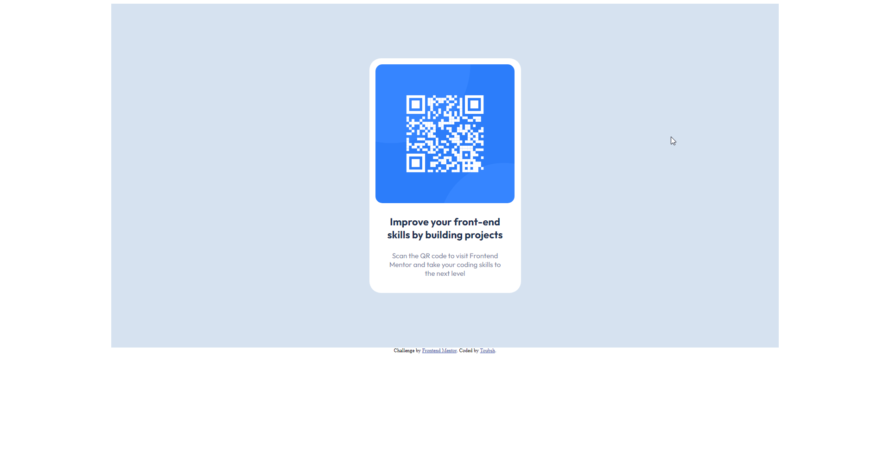

# Frontend Mentor - QR code component solution

This is a solution to the [QR code component challenge on Frontend Mentor](https://www.frontendmentor.io/challenges/qr-code-component-iux_sIO_H). Frontend Mentor challenges help you improve your coding skills by building realistic projects. 

## Table of contents

- [Overview](#overview)
  - [Screenshot](#screenshot)
  - [Links](#links)
- [My process](#my-process)
  - [Built with](#built-with)
  - [What I learned](#what-i-learned)
  - [Useful resources](#useful-resources)
- [Author](#author)

**Note: Delete this note and update the table of contents based on what sections you keep.**

## Overview

### Screenshot

### Links

- Solution URL: [Github](https://github.com/Toubsh/qr_code)
- Live Site URL: [Vercel live app](https://qrcode-amber.vercel.app/)

## My process

- Create layout
- Write CSS
- Fix centering and mobile display

### Built with

- Semantic HTML5 markup
- CSS custom properties
- Flexbox

### What I learned

- Recap of flexbox
- Centering stuff

### Useful resources

- [Flexbox tutorial](https://coryrylan.com/blog/how-to-center-in-css-with-flexbox#:~:text=By%20default%20flex%20items%20will,add%20a%20single%20CSS%20property.&text=By%20using%20align%2Ditems%3A%20center,axis%20of%20the%20flex%20container.) - Centering tutorial with flexbox
- [Responsive Webdesign example](https://www.w3schools.com/css/css_rwd_intro.asp) - Responsive webdesign example

## Author

- Website - [Toubsh]
- Frontend Mentor - [@Toubsh](https://www.frontendmentor.io/profile/Toubsh)
- Codepen.io - [Toubsh](https://codepen.io/Toubsh)